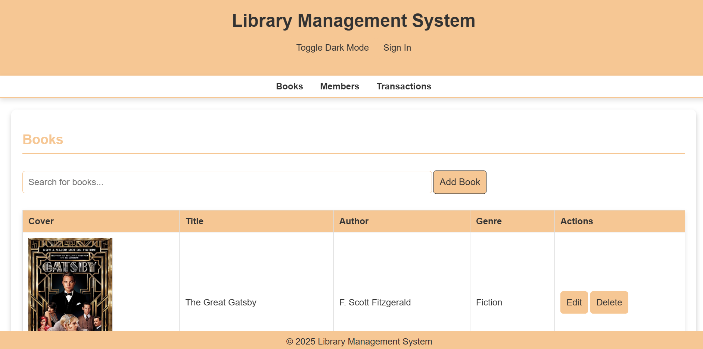
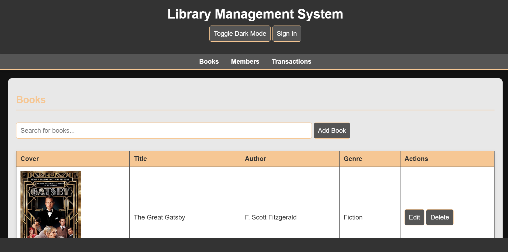
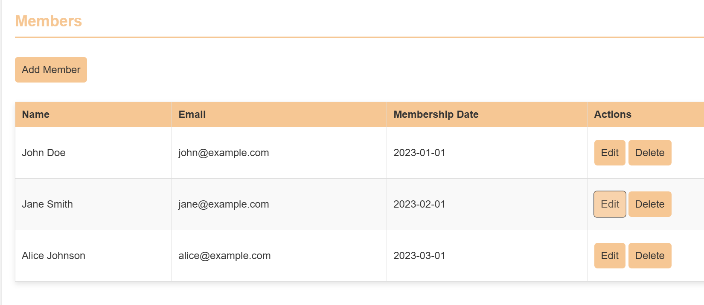
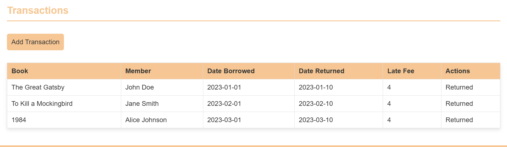

# By: GP-6

This repository houses the code for an integrated library management system developed as a group project for our GitHub class.<br>
The system aims to streamline library operations, providing a user-friendly interface for both librarians and patrons.<br>
<h1 align="center" style="font-size:3em"></h1>

## Features
### 1. User Interface:
* **Dark Mode**: Supports a visually appealing dark mode for comfortable nighttime use.<br>
* **Responsive Design**: Adapts seamlessly to various screen sizes, ensuring optimal viewing on desktops, laptops, tablets, and smartphones.<br>
<h1 align="center" style="font-size:3em"></h1>

### 2. Core Functionality:
* **User Authentication**: Secure user login and registration system.<br>
### 3. Member Management:
* Add new members to the library.<br>
* Edit existing member details (e.g., contact information, membership status).<br>
<h1 align="center" style="font-size:3em"></h1>

### 4. Transaction Management:
* Record book checkouts, returns, and renewals.<br>
* Track fines and overdue notices.<br>
* Edit transaction records as needed.<br>
<h1 align="center" style="font-size:3em"></h1>

### 5. Book Management:
* Add new books to the library catalog, <br>**Including**:<br>
* Book title, author, ISBN, publication year.<br>
* Detailed descriptions and summaries.<br>
* Upload book cover images using image URLs.<br>
* Edit existing book records with updated information.<br>
## Technology:
* Built with HTML, CSS, and JavaScript for a robust and dynamic user experience.<br>
* **Cross-platform compatibility**: Functions effectively across different operating systems and browsers.<br>
* **Hosting**: The website is hosted using GitHub Pages.

## Requirements

    1. IDE /Code Editor: VSCode or any other.
    2. Hosting: GitHub Pages.
    3. Live Server Extension: To review the website.
    4. Prettier Extension: To organise the code.
    5. Auto Rename Tag Extension: For fast code access write up.
    6. Gitingest: For making attractive layout of code.
    7. Code Runner Extension: For detection of valid syntax.

## Installation/Procedure

### 1. Clone the Repository:
* Clone this repository to your local machine using Git:
* Bash

        git clone <https://github.com/Haksham/GP6_5>
    
### 2. Open in VS Code:
* Open the cloned repository in VS Code.
* Install Live Server Extension.
    - Open the VS Code Extensions panel (Ctrl+Shift+X).
    - Search for "Live Server" and install the extension by Ritwick Dey.
    - Start the Live Server.
* Open the index.html file in the editor.
* Right-click anywhere within the file and select "Open with Live Server" from the context menu.

### 3. Access the Website:
* The website will open in your default web browser.
* The URL will be displayed in the VS Code output panel.

### 4. Deployment to GitHub Pages
* Create a gh-pages Branch:
* Open the terminal in VS Code.
    - Create a new branch named gh-pages:
    - Bash
      
            git checkout -b gh-pages
* Copy Files to gh-pages Branch:
* Copy all the necessary files (HTML, CSS, JavaScript, images, etc.) from the main branch to the gh-pages branch.
* Commit and Push Changes:
    - Commit the changes to the gh-pages branch:
    - Bash

            git add .
            git commit -m "Deploy to GitHub Pages"
            Push the gh-pages branch to the remote repository:
            Bash

### 5. git push origin gh-pages
* Configure GitHub Pages:

    - Go to your repository settings on GitHub.
    - Under "GitHub Pages," select the "gh-pages" branch as the source.
* Access the Deployed Website:
    - The deployed website will be available at the following URL:

          https://<your_username>.github.io/<repository_name>

      ###                     Or

## Get the Docker file: [DockerFile](https://hub.docker.com/r/haksham/libms)
## Hosted: [GitHub Pages](https://haksham.github.io/GP6_5/)


## Project Structure
```plaintext
Directory structure:
└── haksham-gp6_5/
    ├── README.md
    ├── CODE_OF_CONDUCT.md
    ├── CONTRIBUTING.md
    ├── Dockerfile
    ├── LICENSE
    ├── SECURITY.md
    ├── docker-compose.yml
    ├── docker_commands.txt
    ├── index.html
    ├── scripts.js
    ├── styles.css
    ├── .dockerignore
    ├── pics/
    │   ├── coderunner.PNG
    │   ├── dark.PNG
    │   ├── main.PNG
    │   ├── members.PNG
    │   └── transcations.PNG
    └── .github/
        ├── FUNDING.yml
        ├── pull_request_template.md
        └── ISSUE_TEMPLATE/
            ├── bug_report.md
            └── custom.md

```
## Contributers:

<kbd>Member 1:</kbd>[Harshvardhan Mehta](https://github.com/Haksham)<br>
<kbd>Member 2:</kbd>[Chandan H K](https://github.com/chandanhk304)<br>
<kbd>Member 3:</kbd>[Deepak B P](https://github.com/bpdeepak)<br>
<kbd>Member 4:</kbd>[Joann Joseph](https://github.com/joannjoseph23)<br>
<kbd>Member 5:</kbd>[Mangesh Nesarikar](https://github.com/xxMangeshxx)<br>
